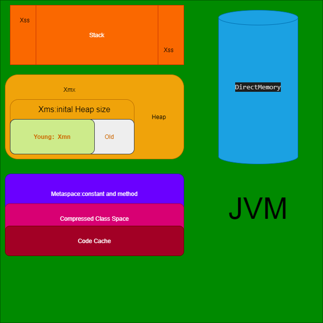
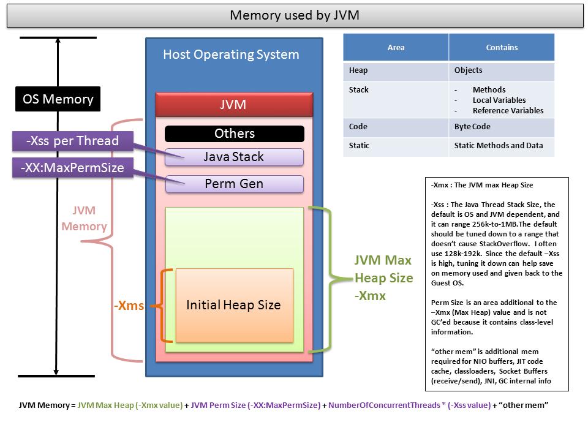

## 题目

画一张图，展示Xmx、Xms、Xmn、Meta、DirectMemory、Xss这些内存参数的关系

## 整理

栈：
Xss 栈大小设置 

堆：
Xmx、最大堆内存
Xms、堆初始化内存

Xmn、Young generation

其他：
Meta、非堆，常量池、代码缓存，压缩的类空间

DirectMemory、 ~~非jvm内的内存~~

## 老师批改：

- 常量池位于方法区之中，方法区位于Meta区之中
- 堆外内存(Direct, Native),实际上位于JVM进程内部
- -Xmx 和 -Xms 设置的是整个堆内存的大小；他们和 Meta区是并列的关系。
- 栈内存不在堆内存之中，也不再Meta区之中，是另一个独立的部分。
- -Xss 控制的是一个线程的栈空间大小
- 注意区分线程栈以及内部的栈帧结构。

## renew:

修改后：

[比较好看的图](https://stackoverflow.com/a/20094595)：是2013年的，[Perm Gen已经从java8移除，新增了metaspace](https://stackoverflow.com/a/22525669)

参考内容： 
- https://www.journaldev.com/2856/java-jvm-memory-model-memory-management-in-java
- https://dzone.com/articles/java-memory-management