# 使用 GCLogAnalysis.java 自己演练一遍串行/并行/CMS/G1的案例。

## 操作记录

```
javac .\GCLogAnalysis.java
```
报错：
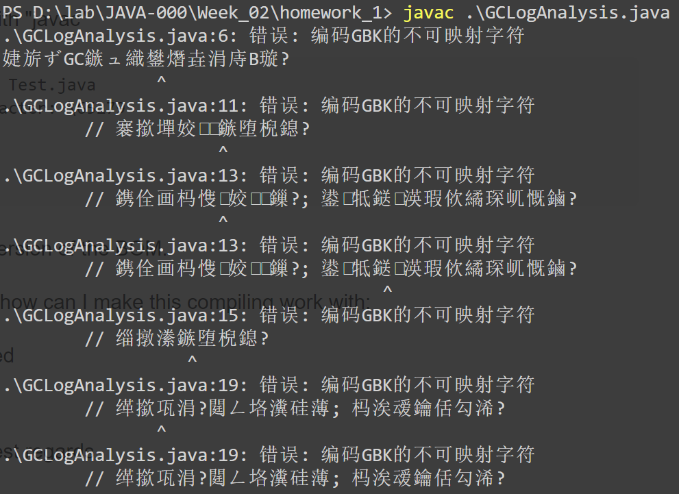

```
javac -encoding UTF8 .\GCLogAnalysis.java
```
1. 显示GC详情
```
java -XX:+PrintGCDetails GCLogAnalysis
```
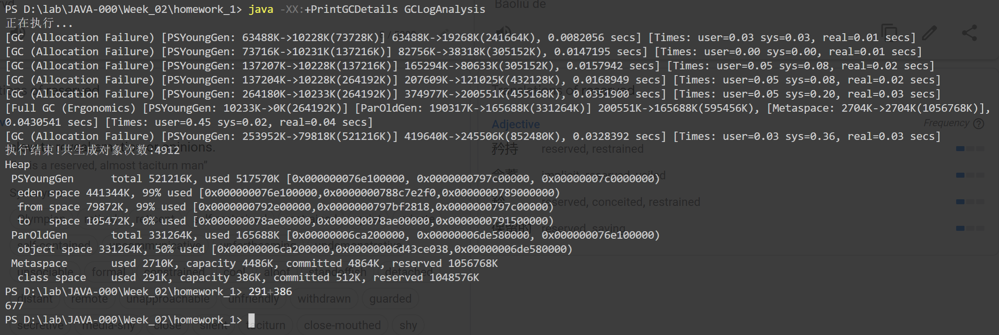
2. 记录到日志
```
java -Xloggc:gc.demo.log -XX:+PrintGCDetails -XX:+PrintGCDateStamps GCLogAnalysis
```
3. 模拟OOM
```
java -Xmx128M -XX:+PrintGCDetails GCLogAnalysis
```
MetaSpace基本没有变化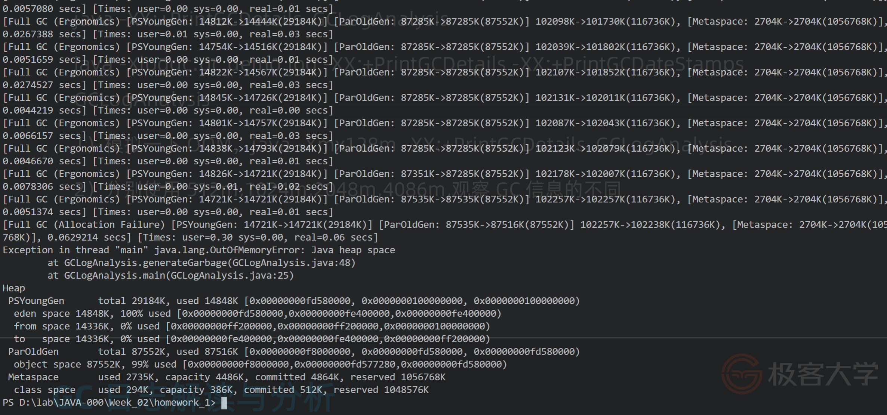
4. 512m,1024m,2048m,4086m

```
java -Xmx512M -XX:+PrintGCDetails GCLogAnalysis
java -Xmx1G -XX:+PrintGCDetails GCLogAnalysis
java -Xmx2G -XX:+PrintGCDetails GCLogAnalysis
java -Xmx4G -XX:+PrintGCDetails GCLogAnalysis
```
Xmx 超过一定值后，情况不再变化

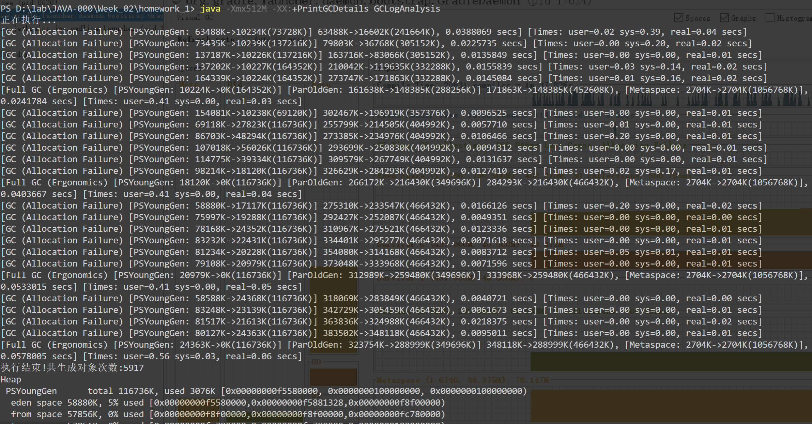
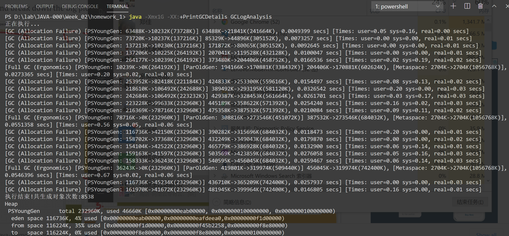
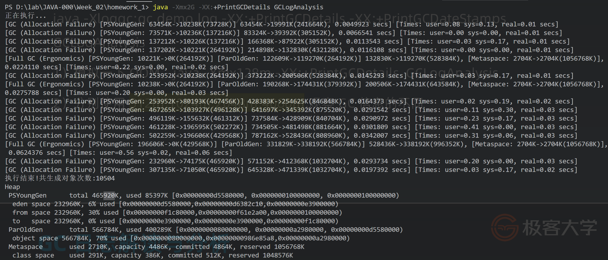
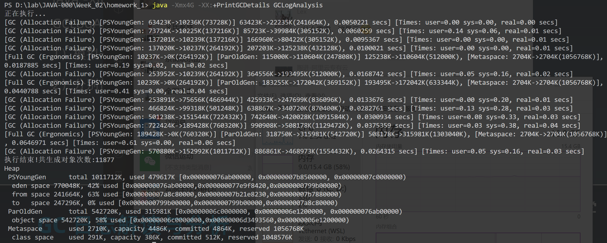
5. 串行GC
```
java -XX:+UseSerialGC -Xms512m -Xmx512m -Xloggc:gc.demo.log -XX:+PrintGCDetails -XX:+PrintGCDateStamps GCLogAnalysis
java -XX:+UseSerialGC -Xms512m -Xmx512m -XX:+PrintGCDetails -XX:+PrintGCDateStamps GCLogAnalysis
java -XX:+UseSerialGC -Xms512m -Xmx512m -XX:+PrintGC GCLogAnalysis
```
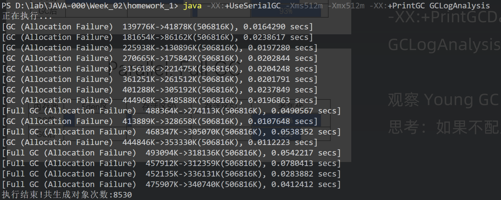
6. 并行
```
java -XX:+UseParallelGC -Xms512m -Xmx512m -Xloggc:gc.demo.log -XX:+PrintGCDetails -XX:+PrintGCDateStamps GCLogAnalysis
java -XX:+UseParallelGC -Xms512m -Xmx512m -XX:+PrintGCDetails -XX:+PrintGCDateStamps GCLogAnalysis
java -XX:+UseParallelGC -Xms512m -Xmx512m -XX:+PrintGC GCLogAnalysis
```
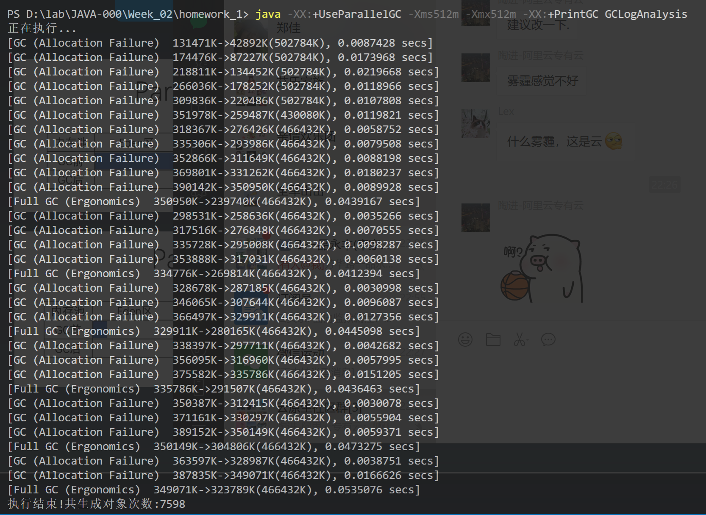
7. UseConcMarkSweepGC CMS

```
java -XX:+UseConcMarkSweepGC -Xms512m -Xmx512m -Xloggc:gc.demo.log -XX:+PrintGCDetails -XX:+PrintGCDateStamps GCLogAnalysis

java -XX:+UseConcMarkSweepGC -Xms512m -Xmx512m -XX:+PrintGCDetails -XX:+PrintGCDateStamps GCLogAnalysis
java -XX:+UseConcMarkSweepGC -Xms512m -Xmx512m -XX:+PrintGC GCLogAnalysis
```
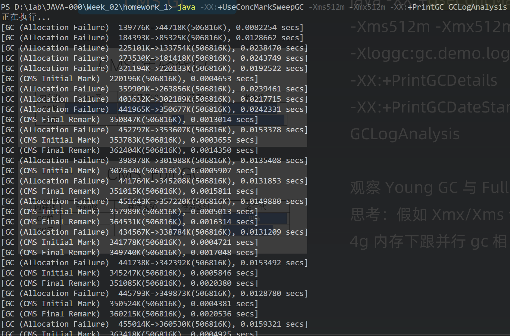
8. UseG1GC

```
java -XX:+UseG1GC -Xms512m -Xmx512m -XX:+PrintGC GCLogAnalysis
```
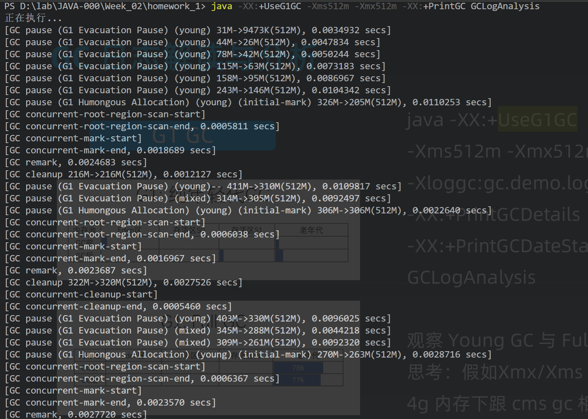
4G
```
java -XX:+UseG1GC -Xms4G -Xmx4G -XX:+PrintGC GCLogAnalysis
```
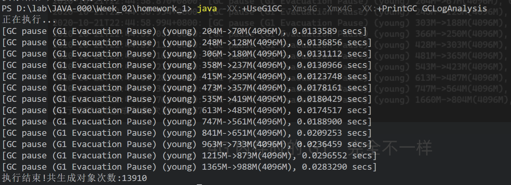

## 其他工具

- https://gceasy.io/