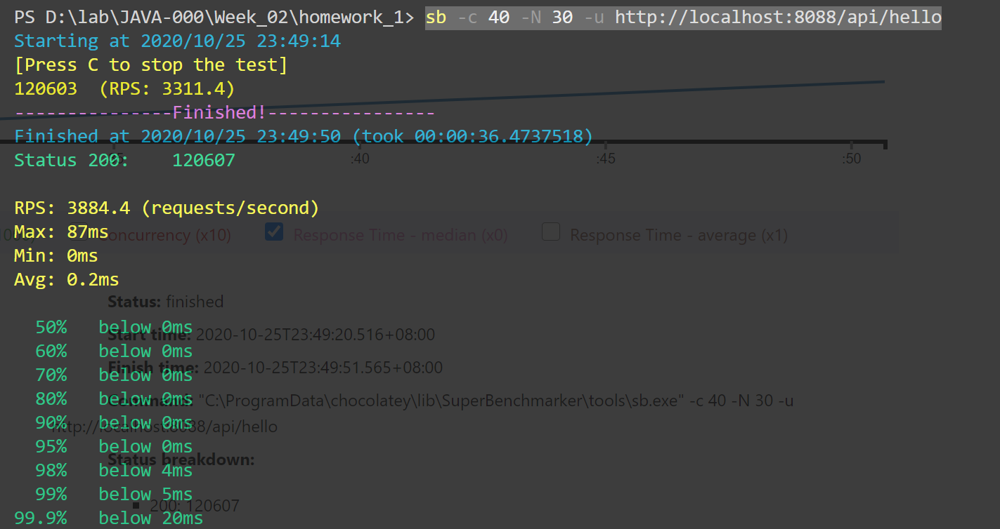

# 使用压测工具（wrk或sb），演练gateway-server-0.0.1-SNAPSHOT.jar 示例。

## 操作记录

```
java -jar gateway-server-0.0.1-SNAPSHOT.jar
```

- http://localhost:8088/api/hello

```
sb -c 40 -N 30 -u http://localhost:8088/api/hello
```

