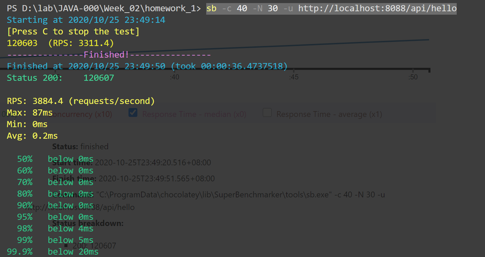
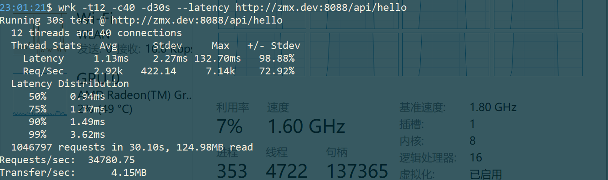
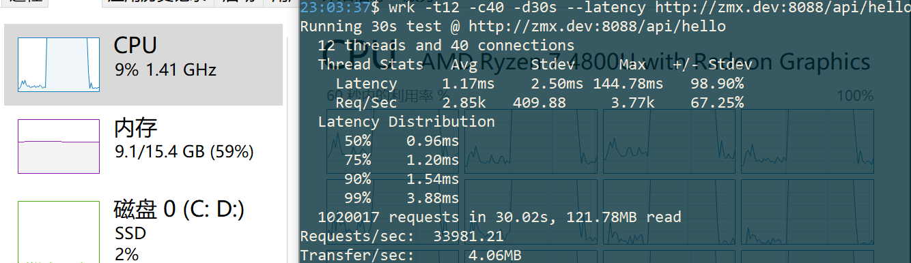

# 使用压测工具（wrk或sb），演练gateway-server-0.0.1-SNAPSHOT.jar 示例。

## 操作记录

```
java -jar gateway-server-0.0.1-SNAPSHOT.jar
```

- http://localhost:8088/api/hello

```
sb -c 40 -N 30 -u http://localhost:8088/api/hello
```



windows install wrk

> https://github.com/wg/wrk/wiki/Installing-wrk-on-Linux

安装需要升级一下apt
```
sudo apt update
sudo apt-get install build-essential libssl-dev git -y
git clone https://github.com/wg/wrk.git wrk
cd wrk
# 即使是 root 也需要sudo。。。
sudo make
# move the executable to somewhere in your PATH, ex:
sudo cp wrk /usr/local/bin

```
---
### 老师的项目
> https://github.com/kimmking/atlantis
---
### 压测过程

03:11:16,视频开始点

```
java -jar -Xms1g -Xmx1g gateway-server-0.0.1-SNAPSHOT.jar
```
- 执行压测：【12线程，40连接，30秒】
```
wrk -t12 -c40 -d30s --latency http://zmx.dev:8088/api/hello
```
- 结果：


> 发现压测的时候，虽然是12线程，但是16个cpu全部100%，而内存几乎没变化
```
jps -lvm
```
