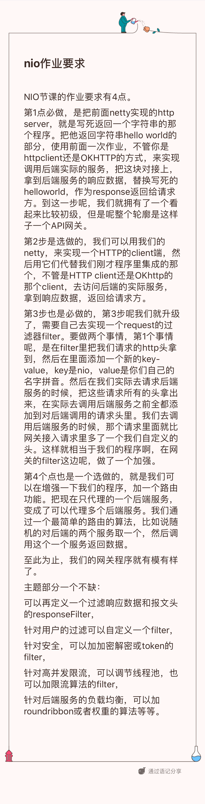

平生活到现在，讨厌的事情不多，其中最最的就是那种一句话需求。“我们的页面要加一个搜索框，就百度首页那种，一天能完成吧”

忙了一个星期加周末，吃着买的速冻饺子看着老师的课，熬到12点。作业就是不能拖，拖着拖着，本来还有点思路，今天一看，就一句话，啥？整合okhttp，往哪整合？要实现啥功能？怎么验证？怎么交付？这是一个啥东西？

又到了imagination的时候了。

要实现一个业务网关，猜测应该有进有出，是业务的吗？还是通用类似nginx那种？

1. 首先，这应该是一个web server，启动后，提供对外服务。
2. 提供一些类似nginx配置文件那种定义的conf或者yaml。控制哪些入口对应哪些后端服务。
3. 造几个（先来一个）后端服务，假装接入到网关中。

### 验证

用户（client）请求网关端口，可以获取到后端服务返回的内容。

## 老师供图：


## 遇到一个okhttp的bug

提示找不到方法 java.lang.NoSuchMethodError: kotlin.collections.ArraysKt.copyInto([B[BIII)[B 

通过添加最新的kotlin标准库弄好了：
> https://stackoverflow.com/questions/57330923/okhttp-nosuchmethoderror-copyinto-in-tlsutil
```xml
        <dependency>
            <groupId>org.jetbrains.kotlin</groupId>
            <artifactId>kotlin-stdlib</artifactId>
            <version>1.3.70</version>
        </dependency>
```