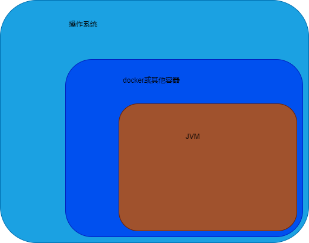
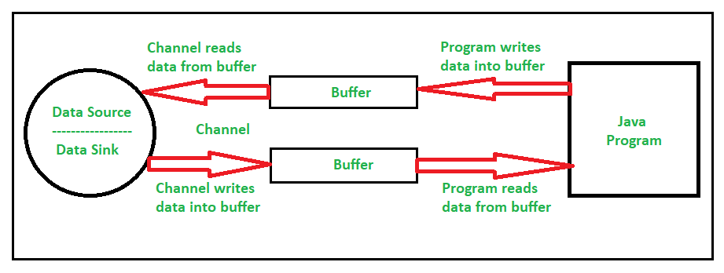
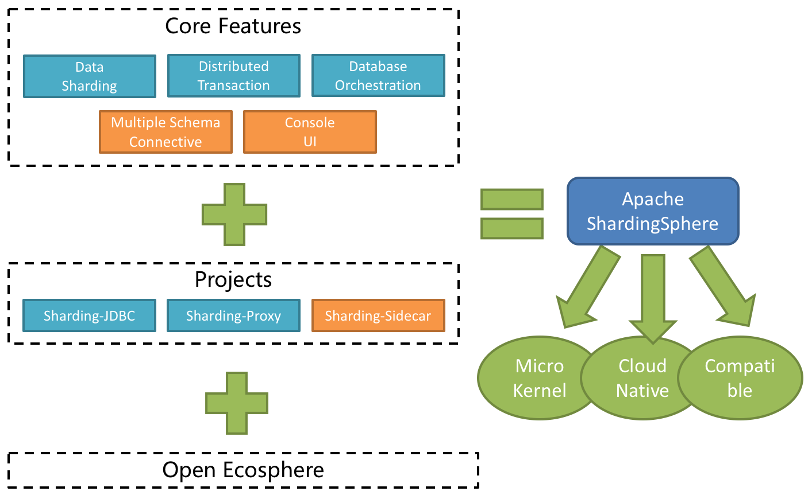
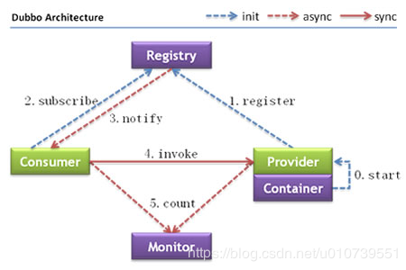
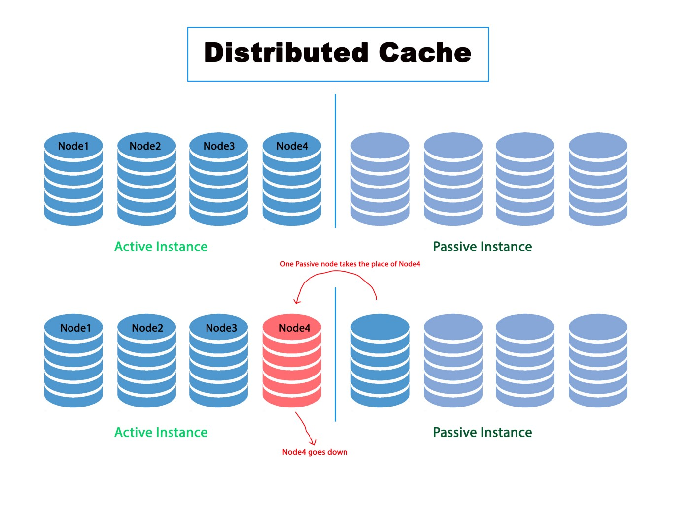
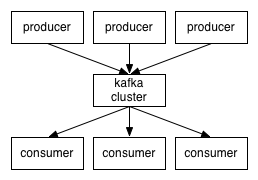
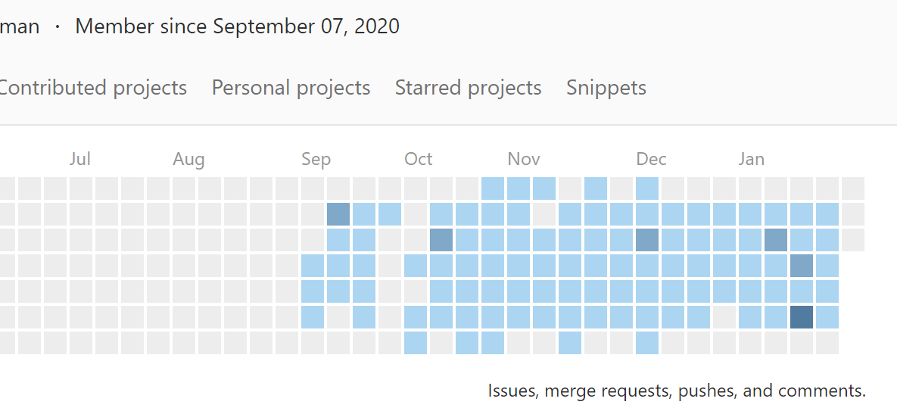

# 毕业项目 :mortar_board:

## 题目

<details>
<summary>1、(必做)分别用 <kbd>100</kbd> 个字以上的一段话，加上一</summary>幅图 (架构图或脑图)，总结自己对下列技术的关键点思考和经验认识:

```
1)JVM
2)NIO
3)并发编程
4)Spring 和 ORM 等框架
5)MySQL 数据库和 SQL
6)分库分表
7)RPC 和微服务
8)分布式缓存
9)分布式消息队列

毕业总结

```
毕业总结写在 `README` 文件里即可。
</details>

## 概况

> 最开始报名的时候，火力开的很满，前五周都很认真的做作业，不过，工作和个人的原因(过于劳累)，精力实在是差了一些，深挖每一个工具和知识点都需要比较大块的时间和反复的尝试。虽然乐于此事，颇有无奈。还好，全部课程的直播都有跟下来，收获颇丰，同时也对自己的能力有了一个认识。

## 思考和经验认识

老师常说的一句话就是‘脱离场景聊需求都是耍流氓（原话可能并不是这样）’，总结下来，技术都是有针对性的，大问题用牛刀，小问题就随便搞搞就好了。面对现在招聘简历上动辄高并发、分布式等要求，对于小公司的人来说，系统从未经历过除了ddos之外的大流量场景，同时硬件上也只限于十台以下服务器的系统，有些业务不会考虑大的框架和工具，而且还存在培训的问题。而且还有一些是2B的项目，访问量都是小得不能再小了，甚至做成C端的都毫无问题。

### 1)JVM



`JVM` 的初衷主要是做系统与业务程序之间的隔离，让 `Java` 代码在转成字节码后，在一个 `JVM` 的盒子里跑，而这个盒子再对多种操作系统的各种底层接口做一个对接，从而实现了跨平台的。

不过，自从 `docker` 诞生后，这个`天生`跨平台的优势就不是那么`特别`了。以及，现在新兴的语言 `golang`、 `rust` 也是生来就跨平台，所以，大的方向上，各种语言之间的趋同性越来越强，包括 `C++` 也都在吸收其他语言优秀的特性~~弥补历史的坑~~。


关于 `JVM` 有个很有意思的事情，仅仅是猜测不一定对，我的笔记本是16核的，但是感觉其中有一些是假的，是虚拟出来的，在做性能测试的时候，某些CPU基本不动，当然，也可以理解成是操作系统在底层做了控制，不允许应用程序使用全部的内核，所以这是一个很有意思的事情，但是又是一个我个人无法考证的事情，到底是我买了假CPU的电脑，还是系统本该如此。

通过 `JVM` 的学习，了解到虚拟机在内存分配上如何划分职责，以及不同的垃圾回收方式对程序性能的影响等等。

### 2)NIO

相对于 `nodejs` 天生就是各种异步，`Java` 还得需要一个 `NIO` 的框架模型才能追上潮流，而且还要分清那么多概念（是为了提高技术的门槛而有意为之吗？），对于新手来说的确起到了很大的劝退作用，幸好还有 `netty` 以及 `spring` 这样的框架做了一层隔离，只要学会 `spring` 的那一套概念和知识（~~就好像spring这一套知识和概念学起来不需要智商一样~~）一样可以享受到 `NIO` 的<kbd>高性能</kbd>。



### 3)并发编程

在其他语言都开始鼓捣~~携程~~协程的时候，包括 `C` 和 `C++` 也有了协程之后，我们来看看 `Java` 线程这个老古董，各种锁各种线程通信的方式。`Thread`、`synchronized`、`ReentrantLock`、`Lock`、`CountDownLatch`、`Future`、`FutureTask`、`CompletableFuture` 我觉得都可以说一个rap了，当然，我觉得的也不~~一定~~对。

在看过各种函数式编程的书后，里面大多强调参数不可变会有效降低并发编程产生的各种问题，于是我们可以看到，很多开源框架中的参数定义都有 `final` 。在极客时间的代码味道课中也有提到业务代码传参尽量都用 `final`。


### 4)Spring 和 ORM 等框架

在~~不断的重复造轮子~~提升 `KPI` 的道路上，我们并没有走远，时刻牢记着 `service`、`bean`、`mapper`、`vo`、`dao`、`po`、`pojo`、愿CRUD万古长青！这种不需要智商的东西真没什么好总结的。

有时候，会想，数据库的查询方式有 `mybatis`,`JPA`,`Hibernate` 等;连接池有 `dbcp`,`c3p0`,`druid` 等；每一样都是可以写一本书那样的技术积累。除了技术人自己，没人在意。业务方完全不关心这些。


### 5)MySQL 数据库和 SQL

关于 `MySQL`,主要就是查询优化，如何更快更高效的查询，

1. 有时候宽表也是一个空间换时间的方案。
2. 在可区分度比较大的查询条件列上加上索引。
3. 把计算结果留在业务代码中，`SQL`语句里减少数据库层面的计算操作。
4. 多个索引的情况，优先查询记录少的索引。
5. 在表后面使用 `force index` ，`use index`强制使用索引。
6. 少用存储过程，业务逻辑还是交给程序代码处理。
7. 未完待续。。。


### 6)分库分表

很早以前，有个领导问我，`twitter` 和`新浪微博`的那些 `feeds` 是怎么保存的，怎么那么快呢，而且不管多早发的内容都可以查到，他们也用 `mysql` 吗？我们当时在做一个财经微博，而我当时也是初出茅庐，又没在新浪或其他大公司呆过，怎么可能知道。但是我当初就极度怀疑，这些大公司估计是根据各个国家、各个省、各个市的人流量，把同样的业务系统重复部署（集群），再由一个调度系统，负责处理跨系统可能带来的交互。也就是说，他们把一个数据库搞了N份，但是我没想到的是，表也可以搞成N份。分库分表，在对业务进行了充分的设计后，可以极大的提高访问速度，并缓解单个存储空间的上限不足问题，而且更易于扩容。

其实，参加这次的进阶学习，就是为了给自己一个多年前的交代，若再有幸遇到多年前的领导，我会告诉他，什么是分库分表。

分库分表需要一定的业务设计，尽量保证分库后的单个业务都在同一个数据库中，若需要跨库的查询或者跨服务的交互，将会很明显的降低业务响应速度。

`sharding` 其实是一种 `partitioning`，没有具体考证，`MySQL8`之前可能对分区支持不好，所以出现很多软件层面的方案，比如[shard-query](https://github.com/greenlion/swanhart-tools)等。

虽然课程中的 `shardingsphere` 还没有应用到实际工作中，但是也是一个很棒的软件层方案。

在以后分布式数据库的未来，这些中间层方案的以后会是什么样，还真是一个疑问。




### 7)RPC 和微服务

因为使用了分库分表，自然是和微服务相关的，当然，一切还是要从业务出发。

`RPC` 为不同的服务间远程调用提供了一种方式。

微服务可以采用 `RPC` 也可以使用其他的通信方式`rest`、`soap`、`GraphQL`，同时，包含服务治理的一整套工具和方案，比如配置管理、服务注册发现、路由、服务限流、过滤等。



### 8)分布式缓存

由于采用了微服务，必然是因为业务上遇到了大流量高并发的需求，为了系统的高可用，和可维护性，在提升业务的访问速度，可以考虑使用缓存，而对于一个系统来说，分布式缓存是一个不错的选择。

关于缓存，重要的其实是缓存策略以及业务特性，并不是所有的缓存场景都需要 `redis`，在一些小巧的本地缓存就能解决问题的情况下，非要用 `redis` 或其他基于网络的缓存系统，其实也无所谓，只是体现不出<kbd>匠心</kbd>。


### 9)分布式消息队列

为了缓冲高并发带来的流量冲击，业务处理采用生产者和消费者模式，可以在一定程度上，




## 老师和同学们的语录

>‘不谈业务的架构都是耍流氓’

>‘脱离场景谈架构，都是没意义的（耍流氓）’

## 收获

除了老师课上教的一些技术类的知识外，关于职场经验老师也提到了很多。还有 `soul` 网关以及其他的开源项目也是让人大开眼界。简直就是连买带送。还有催催老师的情商课，更是稀缺资源，像某些企业级培训机构的这种课程价格都是抵得上一线城市房价的。

不过呢，从心学的知行合一来看，老师教了很多东西，但离学以致用还有一些距离，公司偏业务向的环境，底层依赖于各种开源实现，有一些东西暂时还是用不上的或比较难引入到目前的项目中，一方面会造成编码风格和框架的混乱，另一方面要说服领导和同事使用某个新的东西还是需要一点精力的。

最后，前方有更多的机会~~坑~~等着我们去探索，希望有朝一日自己可以站在一个比较理想的技术高度吧！

## 关于我

老师总是鼓励我们做一些开源相关的事情，可是我们的衣食父母（老板）需要我们的业务代码，而精力总是有限的。去年九月来到这家新公司，为了提高生产力，学习研究使用 `jhipster` 成功为公司交付了两个小项目。期间除了 `Java` 相关的 `maven` 、`mapstruct`、`jpa`、`liquibase`、`spring` 一套内容外，前端的 `echart`、`angular`、`react`、`vue`、`taro` 以及微信小程序相关的开发都有学习。同时，维护着公司另外几个`Java`、`php`、`nodejs`、`ext4j`开发的遗留~~考古~~项目。于是，后期作业实在是抽不出时间做。但这不是借口，待空闲下来，老师的课程还是要再撸一遍的，这是<kbd>约定</kbd>。



## 参考资料

- [API通信方式对比](https://www.altexsoft.com/blog/soap-vs-rest-vs-graphql-vs-rpc/)